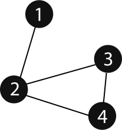

# Graph
Formally, a graph is a pair of sets (V, E), where V is the set of vertices and E is the set of edges, connecting the pairs of vertices. Take a look at the following graph

## Data Structure
In the above Graph, the set of vertices V = {1,2,3,4} and the set of edges E = {12, 23, 24, 34}.

Mathematical graphs can be represented in data structure. We can represent a graph using an array of vertices and a two-dimensional array of edges. Before we proceed further, let's familiarize ourselves with some important terms −

* **Vertex** − Each node of the graph is represented as a vertex. In the following example, the labeled circle represents vertices. 

* **Edge** − Edge represents a path between two vertices or a line between two vertices.

* **Adjacency** − Two node or vertices are adjacent if they are connected to each other through an edge.

* **Path** − Path represents a sequence of edges between the two vertices. 

## Basic Operations
Following are basic primary operations of a Graph −

* **Add Vertex** − Adds a vertex to the graph.

* **Add Edge** − Adds an edge between the two vertices of the graph.

### Recommendation / Exercises

To know more about Graph, please read [Graph Representation](https://www.hackerearth.com/practice/algorithms/graphs/graph-representation/tutorial/).
